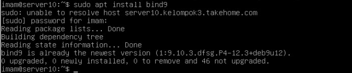
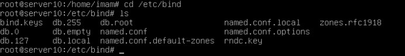
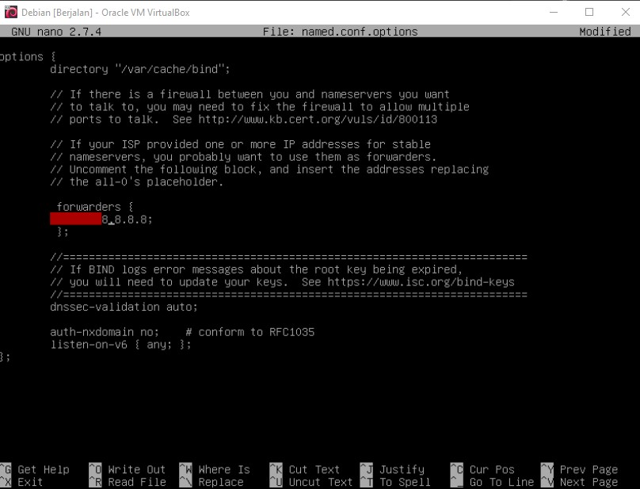
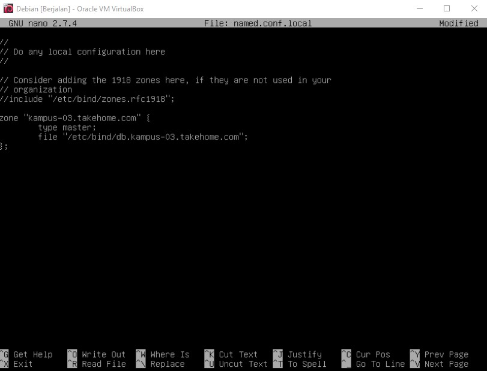
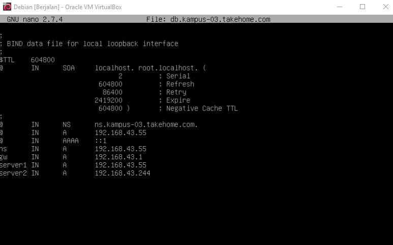
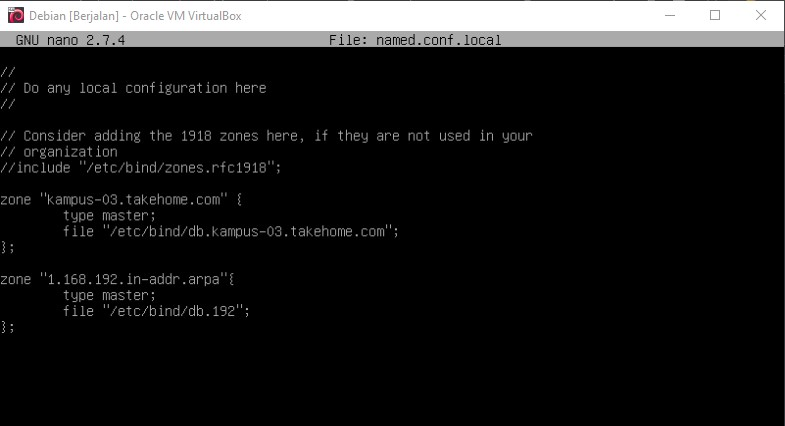
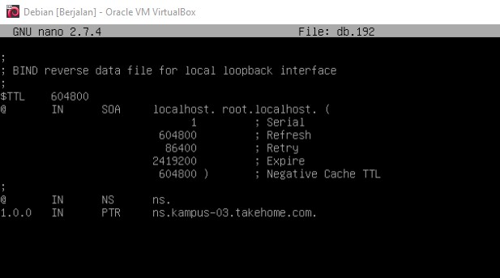
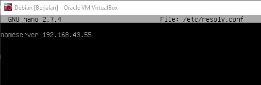
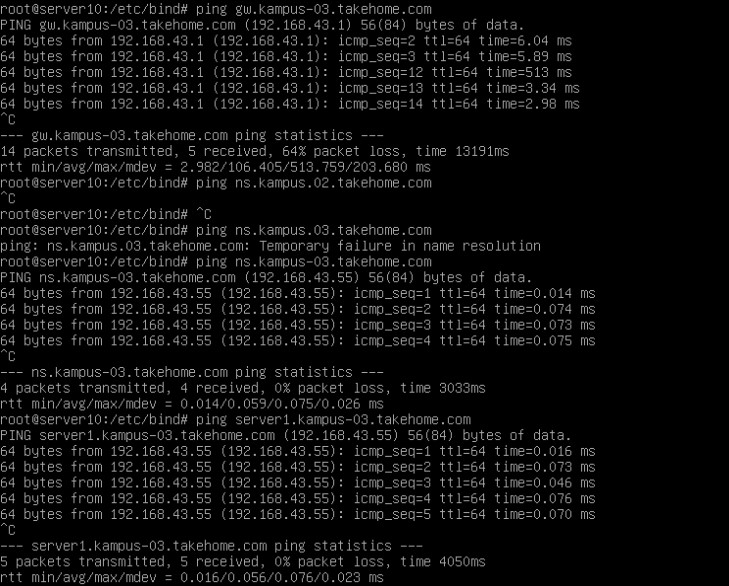
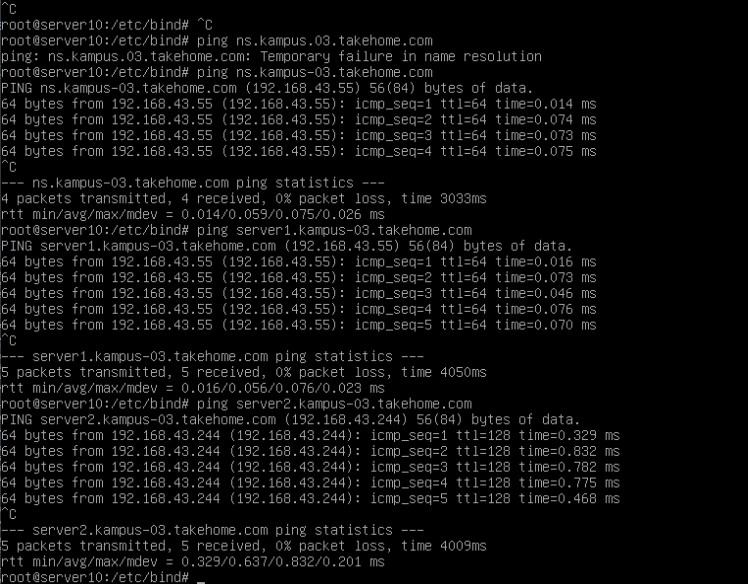

# **KONFIGURASI DNS SERVER DEBIAN** </br>

## **Dosen Pengampu** 

Dr. Ferry Astika Saputra ST, M.Sc

## **Disusun Oleh**

Imam Shofiuddin - 3121600037</br>
Adhika Putri Syafrina Bukka - 3121600058</br>
Matiin Muhammad Rajab - 3121600059</br>
2 D4 IT B

---

## Domain Name Service (DNS)

<p>Domain adalah sebuah nama unik untuk mengidentifikasi suatu server komputer (seperti web server, mail server) di jaringan komputer atau internet sehingga pengguna lebih mudah untuk mengaksesnya tanpa harus mengingat IP address server tersebut. Pada dasarnya untuk bisa mengakses informasi dari sebuah server, Anda harus menggunakan alamat IP (internet protocol). Deretan angka IP ini tentu agak sulit untuk diingat oleh pengguna internet pada umumnya. Untuk mempermudah, maka digunakanlah nama domain sehingga lebih mudah untuk diingat ketika akan diakses. Di dalam struktur hirarki Domain Name System (DNS), nama domain dikelompokkan dalam beberapa tingkatan, yaitu :</p>
<ul>
    <li>Root-level Domain</li>
    <p>Root-level domain adalah top level hirarki sebuah domain atau disebut juga “akar” yang biasanya dilambangkan dengan tanda titik (.) .</p>
    <li>Top-level Domain</li>
    <p>Top-level domain adalah ekstensi nama domain yang berada pada bagian akhir, yaitu setelah tanda titik. Misalnya; .com, .net, .id, dan sebagainya.</p>
    <li>Second-level Domain</li>
    <p>Second-level domain adalah suatu nama domain yang merupakan nama domain setelah ekstensi Top Level Domain. Second-level domain biasanya merujuk pada organisasi yang mendaftarkan nama domain pada suatu registrar domain, misalnya Google.com, Google adalah second-level domain dan .com adalah top-level domain.</p>
</ul>

</br>

---

## Installation

Untuk menginstall BIND9, pada terminal jalankan perintah berikut:

```
sudo apt install bind9
```


</br>

---

## Configuration Files

File konfigurasi DNS disimpan di direktori `/etc/bind`. Jika kita lihat list file pada direktori tersebut, kurang lebih akan seperti ini :<br>
<br>
Pertama-tama, kita harus tahu File-file mana yang akan kita konfigurasi yaitu :

1. ```named.conf``` (Fungsinya untuk redirect DNS)

2. ```db.local``` ( Untuk file forward / mentranslasikan domain ke IP)

3. ```db.127``` ( Untuk file reverse / mentranslasikan IP ke domain)

4. ```/etc/resolv.conf```
  
</br>

---

## Caching Nameserver

Konfigurasi default bertindak sebagai *caching server*. masuk ke dalam file ``` /etc/bind/named.conf. ``` lalu hapus komentar pada blok 'forwarders' kemudian ubah IP untuk mengatur alamat IP server DNS ISP Anda, disini menggunakan 8.8.8.8.

</br>



</br>
Untuk menerapkan konfigurasi terbaru dari layanan setelah kita melakukan perubahan, restart server DNS dengan perintah berikut:

```
sudo service bind9 restart
```

</br>

---

## Menambahkan Zone Bind9

Untuk menambahkan zona DNS ke BIND9 dan mengubah BIND9 menjadi server Primer, edit bagian ```/etc/bind/named.conf.local```, kita tambahkan zona baru :<br><br>
<code>zone "kampus-03.takehome.com" {<br>
    type master;<br>
    file "/etc/bind/db.kampus-03.takehome.com"<br>
}</code>



Selanjutnya kita buat zone file untuk konfigurasi diatas. Disini kita bisa  menggunakan zone file yang sudah ada yakni ```/etc/bind/db.local``` sebagai template untuk membuat berkas ```/etc/bind/db.kampus-03.takehome.com``` dengan menggunakan perintah berikut:

```
sudo cp /etc/bind/db.local /etc/bind/db.kampus-03.takehome.com
```

</br>
Setelah itu kita isikan file tersebut dan kita mapping IP untuk masing masing bagian seperti di bawah ini.

*Forward Zone File (db.kampus-03.takehome.com)*:
</br>



</br>

Restart BIND9 untuk menerapkan perubahan :

```
sudo service bind9 restart
```

</br>

---

## Reverse Zone

Setelah zona disiapkan dan mengubah nama domain menjadi Alamat IP, zona Reverse perlu ditambahkan untuk memungkinkan DNS mengubah Alamat IP menjadi nama. Edit pada bagian ```/etc/bind/named.conf.local``` dan tambahkan syntax berikut:

```
zone ”1.168.192.in−addr.arpa”{
    type master;
    file”/etc/bind/db.192”;
};
```



Sekarang, buat file ```/etc/bind/db.192:``` dengan menyalin file db.127 menggunakan perintah :

```
sudo cp /etc/bind/db.127 /etc/bind/db.192
```

Selanjutnya, edit ```/etc/bind/db.192``` dengan mengubah opsi yang sama dengan ```/etc/bind/db.kampus-03.takehome.com```:

</br>
*Reverse Zone File (db.192)*:
</br>



</br>

Setelah membuat *Reverse Zone File*, mulai ulang BIND9:

```
sudo service bind9 restart
```

</br>

---

## Testing

Langkah yang dilakukan dalam menguji BIND9 adalah menambahkan Alamat IP nameserver ke host resolver. Edit nameserver dan parameter untuk domain pada file ```/etc/resolv.conf```:

*resolv.conf*:
</br>



</br>

Selanjutnya, kita melakukan ping untuk domain yang sudah kita buat dalam file ```etc/bind/db.kampus-03.takehome.com```




<br>



</br>
