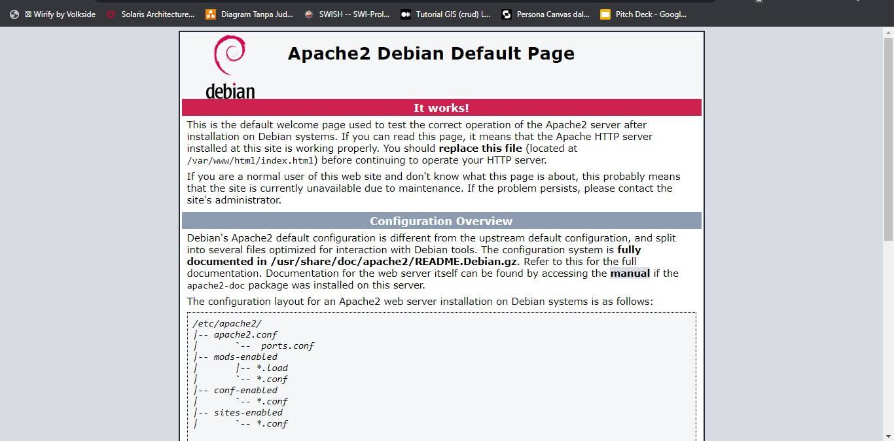
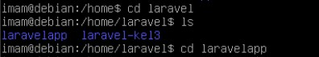

# INTEGRASI DNS-SERVER (MASTER - SLAVE) DENGAN WEB-SERVER DAN INSTALL LARAVEL

### Kelompok 3 :
### Imam Shofiuddin (3121600037)
### Adhika Putri Syafrina Bukka (3121600058)
### Matiin Muhammad Rajab (3121600059)

<br><br>
<hr>


## INSTALASI DNS SERVER (kampus-03.takehome.com)

Untuk menginstall BIND9, pada terminal jalankan perintah berikut:

```
sudo apt install bind9
```


</br>

---

## Configuration Files

File konfigurasi DNS disimpan di direktori `/etc/bind`. Jika kita lihat list file pada direktori tersebut, kurang lebih akan seperti ini :<br>
<br>
Pertama-tama, kita harus tahu File-file mana yang akan kita konfigurasi yaitu :

1. ```named.conf``` (Fungsinya untuk Caching Nameserver)

2. ```named.conf.local``` (Untuk mendaftarkan zona)
3. ```db.local``` yang nantinya akan kita copy ke /var/cache/bind dengan nama file `db.kampus-03.takehome.com`

4. ```/etc/resolv.conf``` (Untuk resolv nameserver)
  
</br>

---

## Caching Nameserver

Konfigurasi default bertindak sebagai *caching server*. masuk ke dalam file ``` /etc/bind/named.conf. ``` lalu hapus komentar pada blok 'forwarders' kemudian ubah IP untuk mengatur alamat IP server DNS ISP Anda, disini menggunakan 8.8.8.8.

</br>


</br>
Untuk menerapkan konfigurasi terbaru dari layanan setelah kita melakukan perubahan, restart server DNS dengan perintah berikut:

```
sudo service bind9 restart
```

</br>

---

## Menambahkan Zone Bind9

Untuk menambahkan zona DNS ke BIND9 dan mengubah BIND9 menjadi server Primer, edit bagian ```/etc/bind/named.conf.local```, kita tambahkan zona baru :<br><br>

```
zone "kampus-03.takehome.com" {<br>
    type master;
    file "db.kampus-03.takehome.com"
    allow-transfer {10.252.108.212;};
}
```


Selanjutnya kita buat zone file untuk konfigurasi diatas. Disini kita bisa  menggunakan zone file yang sudah ada yakni ```/etc/bind/db.local``` sebagai template untuk membuat berkas ```/var/cache/bind/db.kampus-03.takehome.com``` dengan menggunakan perintah berikut:

```
sudo cp /etc/bind/db.local /var/cache/bind/db.kampus-03.takehome.com
```

</br>
Setelah itu kita isikan file tersebut dan kita mapping IP untuk masing masing bagian seperti di bawah ini.

*Forward Zone File (db.kampus-03.takehome.com)*:
</br>


</br>

Restart BIND9 untuk menerapkan perubahan :

```
sudo service bind9 restart
```

</br>

---

## Reverse Zone

Setelah zona disiapkan dan mengubah nama domain menjadi Alamat IP, zona Reverse perlu ditambahkan untuk memungkinkan DNS mengubah Alamat IP menjadi nama. Edit pada bagian ```/etc/bind/named.conf.local``` dan tambahkan syntax berikut:

```
zone ”1.168.192.in−addr.arpa”{
    type master;
    file”/etc/bind/db.192”;
};
```


Sekarang, buat file ```/etc/bind/db.192:``` dengan menyalin file db.127 menggunakan perintah :

```
sudo cp /etc/bind/db.127 /etc/bind/db.192
```

Selanjutnya, edit ```/etc/bind/db.192``` dengan mengubah opsi yang sama dengan ```/etc/bind/db.kampus-03.takehome.com```:

</br>
*Reverse Zone File (db.192)*:
</br>


</br>

Setelah membuat *Reverse Zone File*, mulai ulang BIND9:

```
sudo service bind9 restart
```

</br>

---

## Testing

Langkah yang dilakukan dalam menguji BIND9 adalah menambahkan Alamat IP nameserver ke host resolver. Edit nameserver dan parameter untuk domain pada file ```/etc/resolv.conf```:

*resolv.conf*:
</br>


</br>

Selanjutnya, kita melakukan ping untuk domain yang sudah kita buat dalam file ```etc/bind/db.kampus-03.takehome.com```


<br>

<hr>

## KONFIGURASI WEB SERVER (APACHE, MYSQL, PHP)

<br>

IP Address Web server : 192.168.3.14 

<br>

1) Upgrade package dengan perintah `apt upgrade`<br>
   
2) Selanjutnya kita install ca-certificates dan apt-transport-https dengan perintah `sudo apt install ca-certificates apt-transport-https `
3) Kemudian, kita install web server menggunakan Apache dengan perintah `sudo apt install apache2`.
4) Pastikan sudah bisa jalan Apache-nya dengan mengecek statusnya (`systemctl status apache2`) dan mengakses alamat ip server di browser.<br>
   <br><br>
   
5) Selanjutnya, kita menginstall mysql-server dengan perintah `sudo apt install mysql-server`.
6) Pastikan statusnya active, cek dengan perintah `systemctl status mysql`<br>
   
7) Selanjutnya, kita install paket php diantaranya php, php-mysql, dan libapache2-mod-php menggunakan perintah `sudo apt install php php-mysql libapache2-mod-php`, yang berguna untuk : 
   1) php -> bahasa pemrograman server-side populer yang digunakan untuk mengembangkan aplikasi web dinamis.
   2) php-mysql -> ekstensi PHP yang memungkinkan penggunaan MySQL/MariaDB dengan PHP. Ekstensi ini diperlukan jika Anda ingin mengakses atau memanipulasi data yang disimpan di database MySQL/MariaDB dari aplikasi web yang dibuat dengan PHP.
   3) libapache2-mod-php -> modul Apache untuk PHP. Modul ini memungkinkan Apache untuk memproses dan mengeksekusi file PHP pada server web.
8) Setelah kita menginstall paket diatas, kita dapat menaruh file website kita di direktori /var/www/html.
9) Buat skrip PHP dengan fungsi phpinfo() di bawah root dokumen Apache. Untuk melakukan ini, edit file /var/www/html/info.php di editor teks favorit Anda dan tambahkan konten di bawah ini ke file dan simpan.<br>
    `<?php phpInfo(); ?>`<br>
    
10) Sekarang akses file info.php di browser web menggunakan alamat IP server kita.<br>
    
11) Selesai konfigurasi web server.

## Instalasi Laravel 
Pastikan sudah menginstal komponen web server diatas.
1) Pertama, kita instal package curl dengan perintah 

```	
apt-get install curl
```

2) kemudian gunakan curl untuk menginstal composer, composer digunakan untuk menginstal dependensi laravel. gunakan perintah 

```
curl -sS https://getcomposer.org/installer | php
```

3) kemudian pindahkan ke /usr/local/bin , dengan perintah
 
```
mv composer.phar /usr/local/bin/composer
```

4) kemudian install laravelnya (ganti nama projeknya sesuka kamu) di direktori home atau yang lain dengan perintah 

```
composer create-project laravel/laravel [nama_projek]
```
disini saya sudah install project laravel di direktori /home/laravel dengan nama project laravelapp. <br><br>


5) Ubah kepemilikan direktori Laravel pada pengguna webserver dan juga izinnya, menggunakan perintah di bawah ini :

```
sudo chown -R www-data:www-data /home/laravel/laravelapp
sudo chmod -R 775 /home/laravel/laravelapp/storage
```

6) Lalu jalankan laravelnya dengan masuk ke dalam direktori projek lalu jalankan `php artisan serve` untuk menjalankan di local. Dan ketika ingin mengaksesnya lewat IP , kita menggunakan perintah `php artisan serve --host=NOMOR_IP --port=8000`.<br><br>

7) Tampilan ketika berhasil diakses.<br>


<hr>

## MENAMBAHKAN IP WEB SERVER KE DOMAIN kampus-03.takehome.com DENGAN SUB DOMAIN www

1) Pada DNS-Server kampus-03.takehome.com kita masuk ke dalam direktori /var/cache/bind
2) Kemudian edit file db.kampus-03.takehome.com
3) Tambahkan IP dan sub domain www untuk web server seperti di bawah ini. <br>


4) Selesai

<hr>

## MENDAFTARKAN DOMAIN kampus-03.takehome.com PADA DNS-SERVER MASTER (takehome.com)

<br>

### NOTE : Kita lakukan instalasi dns-server pada PC master sama seperti instalasi dns diatas

<br>

Kemudian pada dns-server master (takehome.com) kita daftarkan domain kita di dalam file `/etc/bind/named.conf.local` tambahkan, zona domain kita :
```
zone "kampus-03.takehome.com" IN {
    type slave;
    file "db.kampus-03.takehome.com"
    masters {192.168.3.10;};
}
```

Maka seluruh domain yang termasuk ke dalam zona dns-server master tersebut dapat mengakses domain satu sama lain.