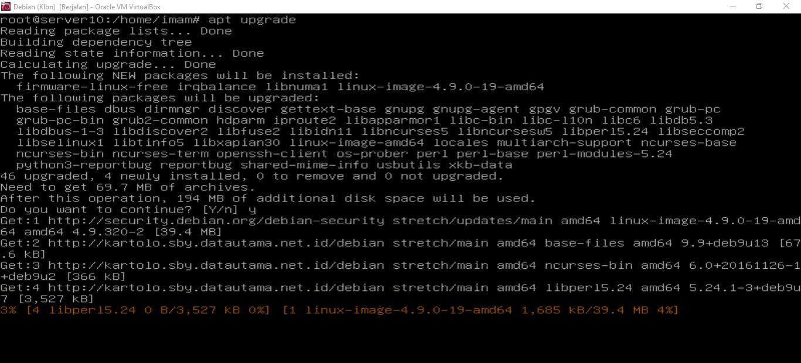
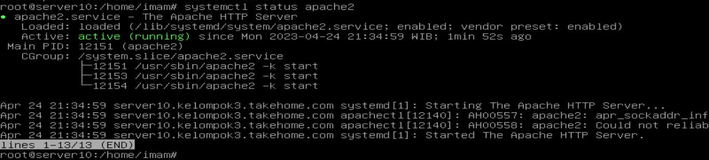
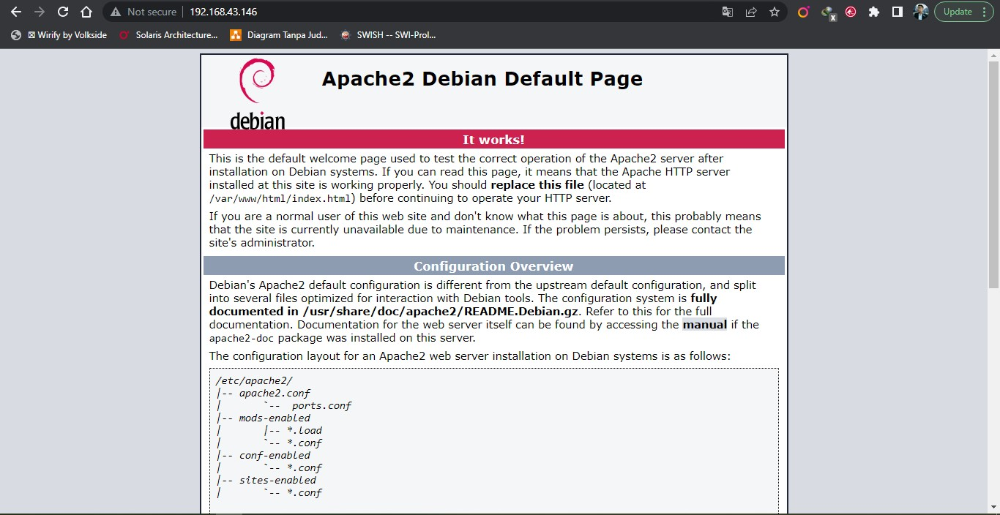
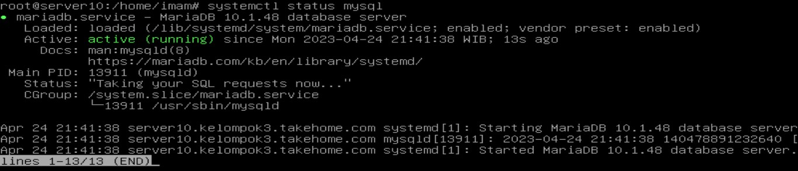
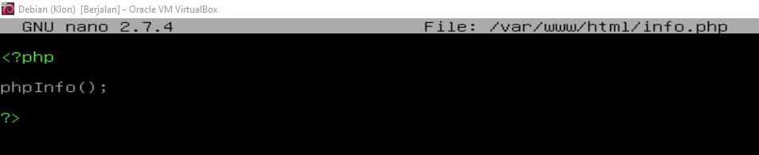
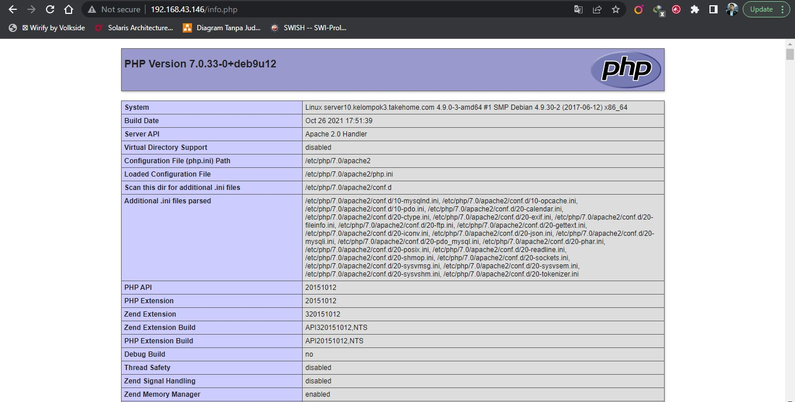
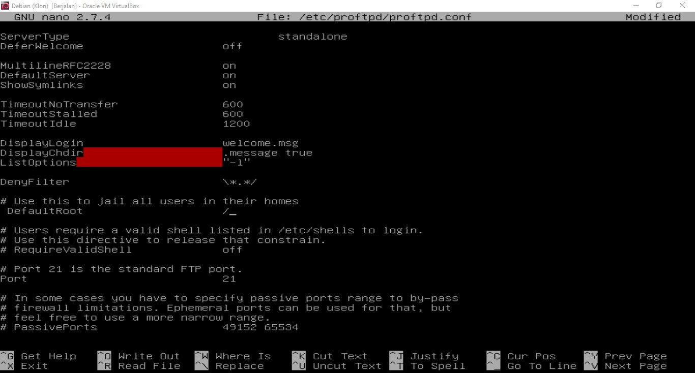
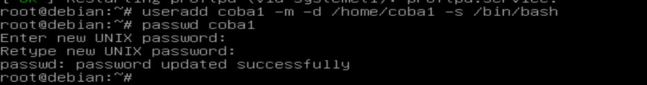
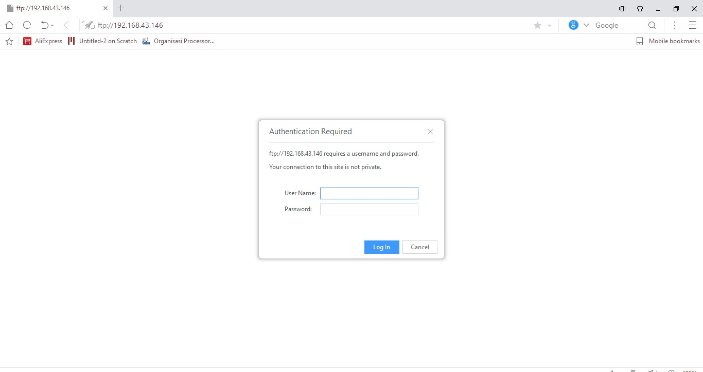
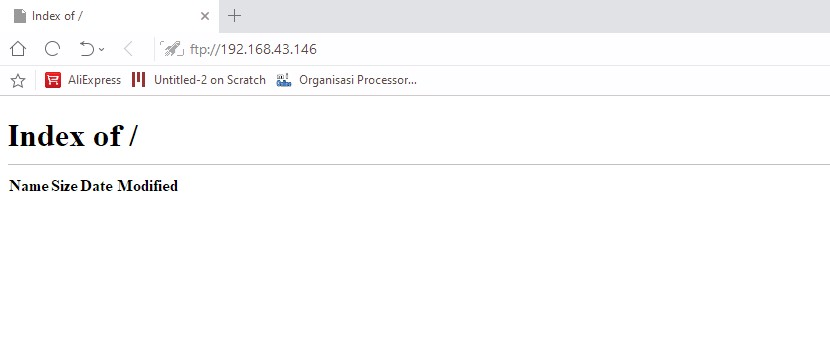

## Konfigurasi Web Server (Apache, Mysql, PHP) dan FTP di Linux Debian

### A. Konfigurasi Web Server (Apache, MySQL, PHP)
1) Upgrade package dengan perintah `apt upgrade` 
   
2) Selanjutnya kita install ca-certificates dan apt-transport-https dengan perintah `sudo apt install ca-certificates apt-transport-https `
3) Kemudian, kita install web server menggunakan Apache dengan perintah `sudo apt install apache2`.
4) Pastikan sudah bisa jalan Apache-nya dengan mengecek statusnya (`systemctl status apache2`) dan mengakses alamat ip server di browser. 
     
   
5) Selanjutnya, kita menginstall mysql-server dengan perintah `sudo apt install mysql-server`.
6) Pastikan statusnya active, cek dengan perintah `systemctl status mysql` 
   
7) Selanjutnya, kita install paket php diantaranya php, php-mysql, dan libapache2-mod-php menggunakan perintah `sudo apt install php php-mysql libapache2-mod-php`, yang berguna untuk : 
   1) php -> bahasa pemrograman server-side populer yang digunakan untuk mengembangkan aplikasi web dinamis.
   2) php-mysql -> ekstensi PHP yang memungkinkan penggunaan MySQL/MariaDB dengan PHP. Ekstensi ini diperlukan jika Anda ingin mengakses atau memanipulasi data yang disimpan di database MySQL/MariaDB dari aplikasi web yang dibuat dengan PHP.
   3) libapache2-mod-php -> modul Apache untuk PHP. Modul ini memungkinkan Apache untuk memproses dan mengeksekusi file PHP pada server web.
8) Setelah kita menginstall paket diatas, kita dapat menaruh file website kita di direktori /var/www/html.
9) Buat skrip PHP dengan fungsi phpinfo() di bawah root dokumen Apache. Untuk melakukan ini, edit file /var/www/html/info.php di editor teks favorit Anda dan tambahkan konten di bawah ini ke file dan simpan. 
    `<?php phpInfo(); ?>` 
    
10) Sekarang akses file info.php di browser web menggunakan alamat IP server kita. 
    
11) Selesai konfigurasi web server.

### B. Konfigurasi FTP Server 
1) Lakukan instalasi paket ftp menggunakan proftpd dengan perintah `apt install proftpd`.
2) aktifkan defaultroot pada bagian proftpd.conf dengan mengetikkan nano /etc/proftpd/proftpd.conf dan hilangan tanda pagar # dibagian depan defaultroot
ubah tanda ~ menjadi / dan jangan lupa simpan. 

3) Restart service ftp dengan perintah `/etc/init.d/proftpd restart`. 
   
4) Selanjutnya, kita buat user baru untuk ftp dengan perintah `useradd [nama user] -m -d /home/[direktori user] -s /bin/bash`. Lalu buat passwordnya dengan perintah `passwd [nama user]`.
   
5) Kemudian, kita uji ftp server kita dengan mengakses alamat ip server di website dengan protokol ftp seperti berikut : `ftp://192.168.43.146`, jika berhasil maka browser akan meminta memasukkan username dan password. 
   
6) Jika berhasil masuk maka akan diarahkan ke folder user tersebut. 
   
7) Selesai.
