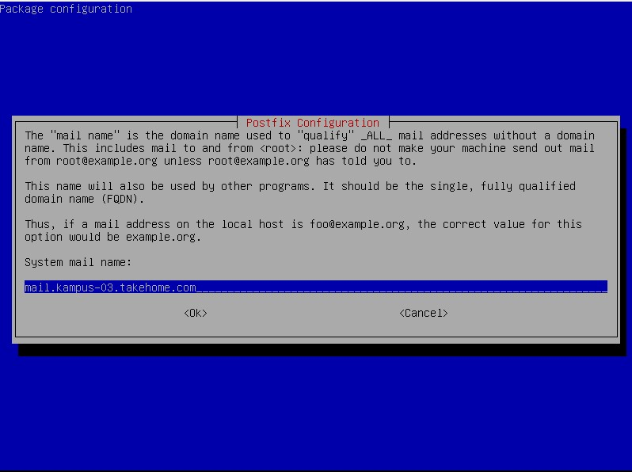
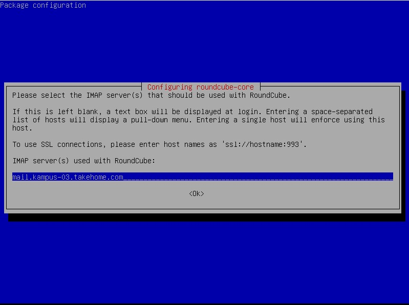

# INSTALASI MAIL SERVER DI DEBIAN 10 MENGGUNAKAN ROUNDCUBE
### Kelompok 3 :
### Imam Shofiuddin (3121600037)
### Adhika Putri Syafrina Bukka (3121600058)
### Matiin Muhammad Rajab (3121600059)

<hr>

## Langkah-langkah

1. Pastikan sudah menginstall web server (apache2), mariadb-server dan sudah konfigurasi dns untuk mail.
2. konfigurasi untuk file apache2 nya
```
nano /etc/apache2/sites-available/000-default.conf
```

<br>

3. Selanjutnya konfigurasi mariadb-server seperti dibawah, ini digunakan agar kita nanti dapat mengakses database kita dengan menggunakan user root.


<br>

4. paket selanjutnya adalah dovecot-imapd, dovecot-imapd ini sebagai kurir pesan kita/pengantar. Cara menginstallnya dengan perintah :

```
apt-get install dovecot-imapd
```

5. konfigurasi file dovecot dengan perintah
```
nano /etc/dovecot/conf.d/10-mail.conf
```


6. install postfix dengan perintah

```
apt-get install postfix
```


<br>

7. Jika sudah, selanjutnya kita membuat dan menentukaan directory mail server kita dengan cara :

```
maildirmake.dovecot /etc/skel/Maildir
```

8. Dan kita konfigurasi file postfixnya :

```
nano /etc/postfix/main.cf
```


9. Setelah dikonfigurasi, selanjutnya kita konfigurasi ulang postfix dengan perintah :

```
dpkg-reconfigure postfix
```

seperti inilah proses konfigurasinya :


Note : dengan menambahkan 0.0.0.0/0 kita dapat mengirimkan email ke semua network yang terhubung


<br>

10. Paket selanjutnya adalah web mailnya/tampilan GUI untuk mail server kita, kali ini kita akan menggunakan roundcube. Cara instalasinya dengan perintah :

```
apt-get install roundcube
```


<br>

11. setelah diinstall, selanjutnya kita konfig ulang roundcubenya dengan perintah :

```
dpkg-reconfigure roundcube-core
```

seperti inilah prosesnya :



12. Jika sudah dikonfigurasi ulang, lalu samakan konfigurasi file roundcube dengan perintah

```
nano /etc/roundcube/config.inc.php seperti 
```

berikut yang lain biarkan saja default:


13. Jika sudah, coba sekarang kita akses web mail kita menggunakan browser.

Sebelum login, kita harus membuat user terlebih dahulu dengan perintah :
```
adduser [nama user]
```

14. Jika sudah, sekarang coba login menggunakan user yang telah dibuat

Seperti inilah tampilan awal roundcube:


15. Sekarang kita coba mengirim pesan antar user :


16. dan hasilnya pada user lain seperti berikut :


