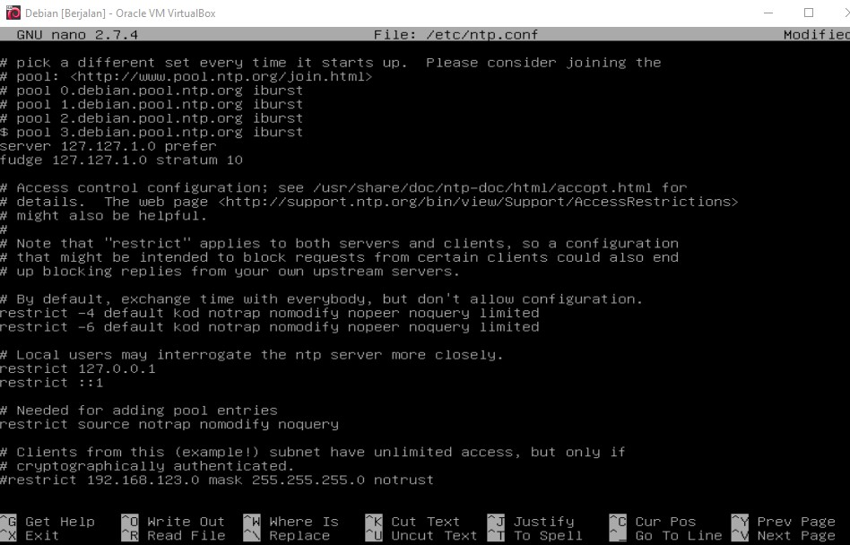
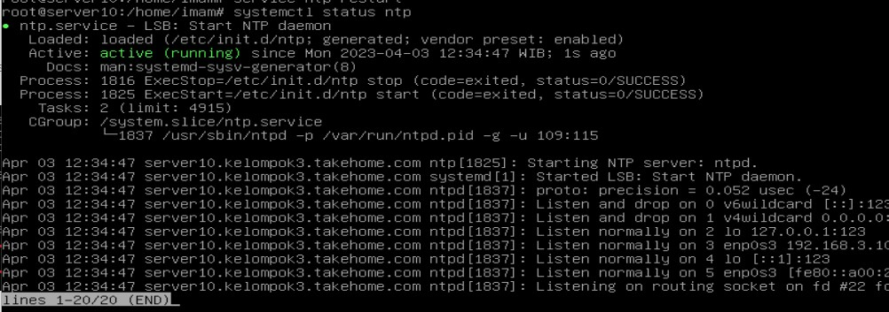
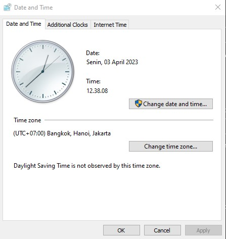
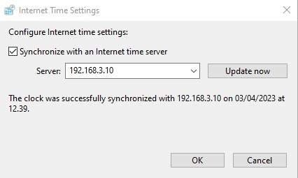

<h1>NTP</h1>
NTP (Network Time Protocol) adalah sebuah protokol yang digunakan untuk pengsinkronan waktu (menyamakan waktu) di dalam sebuah jaringan, baik itu LAN maupun jaringan internet. Protokol NTP ini berjalan pada port 123. Proses penyamaan waktu yang dilakukan oleh NTP sangatlah akurat. NTP ini berjalan pada dua sisi yaitu Server dan Client. Di server NTP ini berfungsi sebagai server yang menyimpan penanggalan waktu yang akurat dan nantinya akan di request oleh NTP Client.  

<h1>Set NTP ke 0.id.pool.ntp.org</h1>

Pertama, kita set time ke Asia/Jakarta dengan perintah berikut.
   

Lalu jangan aktifkan RTC (Real Time Clock) ke UTC dengan perintah berikut.

Aktifkan NTP client untuk sinkronisasi waktu dengan perintah berikut.

Edit timesyncd.conf untuk setting NTP servers yang anda gunakan dengan perintah <code>sudo nano /etc/systemd/timesyncd.conf</code>.

Restart NTP dengan perintah <code>sudo systemctl restart systemd-timesyncd</code>

lihat hasilnya dengan perintah <code>timedatectl</code>

 

<h1>NTP Server</h1>
<h3><b>Instalasi NTP Server</b></h3>

Untuk menginstall paket ini kita gunakan perintah <code>apt-get install ntp</code> maka ntp server akan terinstall

<h3><b>Konfigurasi NTP Server</b></h3>
Pertama buka file konfigurasi ntp dengan perintah <code>sudo nano /etc/ntp.conf</code>. 
Setelah itu beri tanda pagar (#) pada depan text pool 0 sampai server 3. Lalu tambahkan text baru dibawahnya untuk membuat NTP Server. 
 
- server 127.127.1.0 : membuat agar NTP Server mensinkronasikan ntp dengan waktu (penanggalan) yang ada di local sistem NTP Server 
- fudge 127.127.1.0 stratum 1 : membuat ntp server sebagai mode server yaitu pada stratum (strata) 1.  

Lalu buang tanda pagar (#) pada text restrict yang berada di bawah text # cryptographically authenticated. Lalu ubah menjadi network address dan netmask antara NTP Server dengan NTP Client dan tambahi notrap nomodify 
  
Lalu restart service ntp untuk memulai ulang service ntp serta mengaktifkan semua konfigurasi yang telah kita ubah dengan perintah <code>service ntp restart</code>  
Cek dan pastikan bahwa NTP Server sudah aktif dengan perintah <code>systemctl status ntp</code> 
  

<h3><b>Tes NTP Server</b></h3>
buka client windows, lalu buka change date and time settings untuk mengubah pewaktuan dari client.  
  
Lalu buka menu tab internet time lalu buka change setting kemudian ubah kolom server menjadi ip address dari NTP Server. Lalu klik pada tombol Update now untuk mengaktifkan NTP Client. Jika NTP berhasil maka akan muncul tulisan “The clock was Successfully synchronized”.  
  

