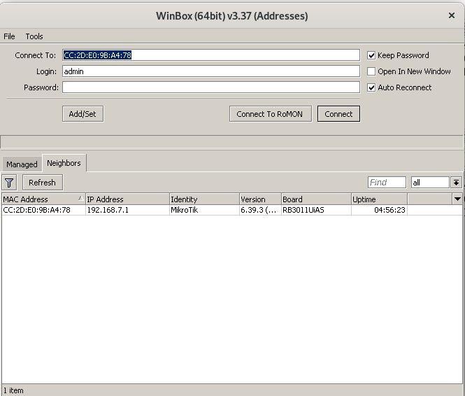
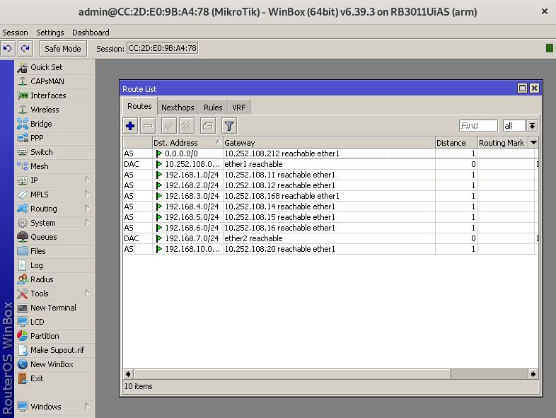
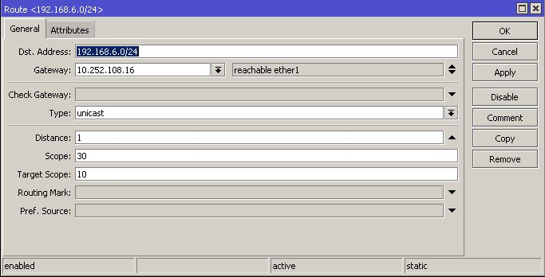
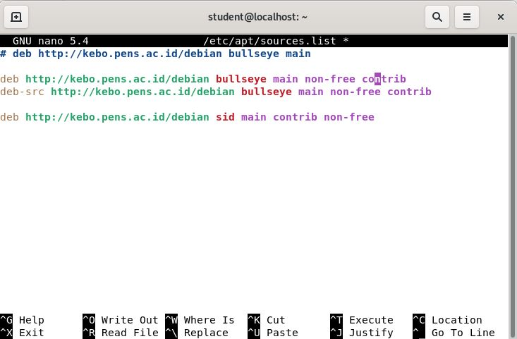
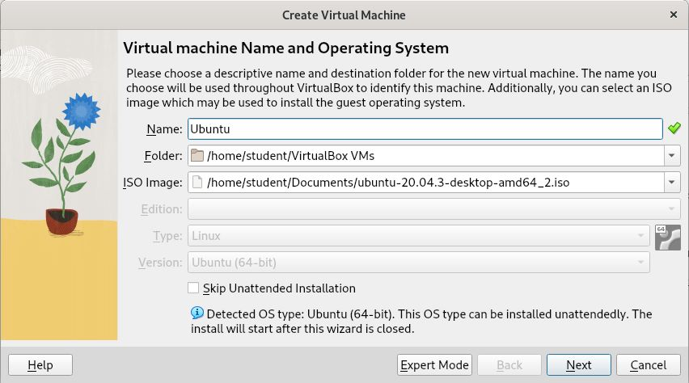
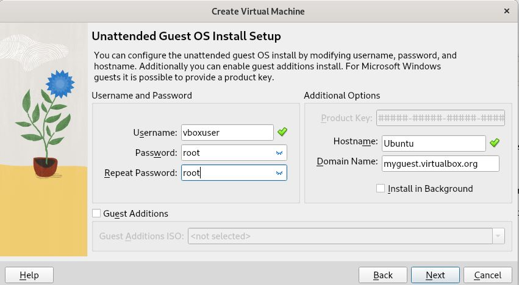
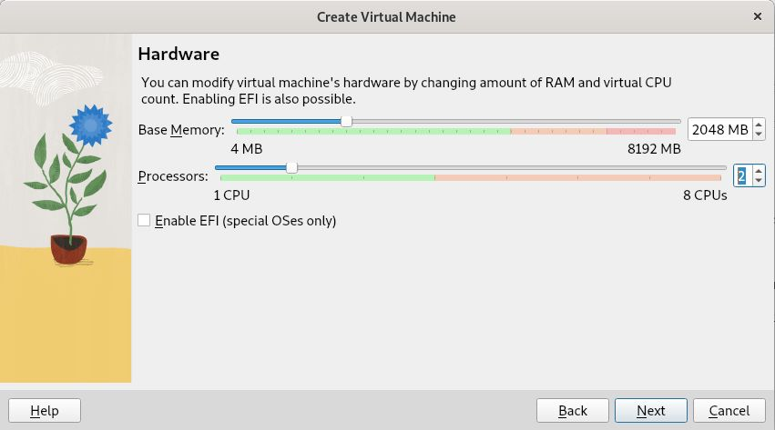
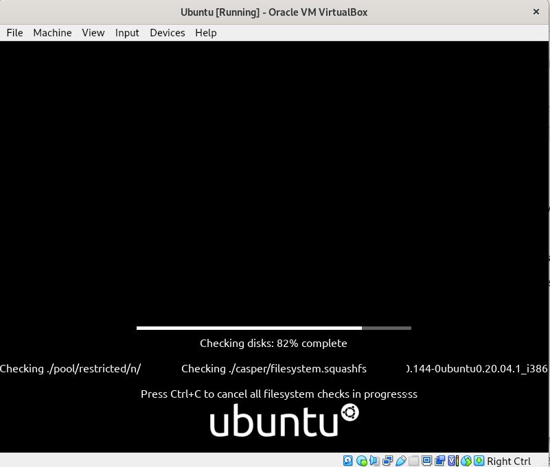
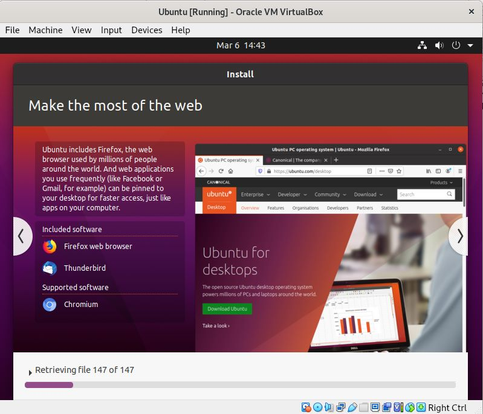

# MIKROTIK Route Configuration and Install VirtualBox in Linux Debian
##### 06 Maret 2023

## OVERVIEW
[Run Winbox.exe in Linux Debian using command wine](#run-winboxexe-in-linux-debian-using-command-wine)

[Mikrotik Routing Configuration using winbox](#mikrotik-routing-configuration-using-winbox)

[Installing VirtualBox in Linux Debian](#installing-virtualbox-in-linux-debian)

[Installing Ubuntu OS in VirtualBox](#installing-ubuntu-os-in-virtualbox)

## Run Winbox.exe in Linux Debian using command wine
Dalam Linux, kita dapat menjalankan program .exe menggunakan layanan aplikasi Wine. berikut ini cara menjalankan program aplikasi .exe di Linux Debian :
1. Kita install terlebih dahulu package wine dengan mengeksekusi perintah <code>apt install wine</code>.
2. Kemudian, tunggu instalasi selesai.
3. Jika instalasi telah selesai maka untuk menjalankan program .exe di linux bisa menggunakan perintah <code>wine [nama file aplikasi]</code>. Misalnya kita ingin membuka file Winbox64.exe , maka kita dapat menggunakan perintah <code>wine Winbox64.exe </code>.
   
## Mikrotik Routing Configuration using Winbox
Untuk melakukan konfigurasi routing menggunakan Mikrotik router, salah satu caranya adalah dengan menggunakan winbox. Berikut langkah-langkah konfigurasi routing di Mikrotik :
1. Agar terhubung ke winbox maka kita harus menghubungkan router mikrotik dengan komputer yang memiliki aplikasi winbox menggunakan kabel LAN yang dihubungkan ke salah satu interface di Mikrotik (Kecuali interface yang mengarah ke internet).
2. Setelah terhubung maka kita buka aplikasi winbox dan pada Tab Neighbor akan ada list network yang terhubung dengan router. 
   
3. Kita klik pada bagian MAC Address, kemudian Connect.
4. Maka akan masuk ke dalam halaman konfigurasi. 
    
5. Kita pilih pada bagian IP > Routes, maka akan muncul Route list sama seperti tampilan di atas.
6. Untuk menambahkan Routing baru, kita bisa menambahkannya dengan menekan tombol "+" pada Routes. nanti akan muncul seperti di bawah ini. 
   
   Hal yang perlu diisi adalah  
   * Dst. Address , yaitu alamat network tujuan
   * Gateway, yaitu alaman IP router yang digunakan sebagai gateway ke network yang dituju.
7. Jika sudah mengisi 2 hal tersebut maka kita bisa langsung 'Apply' kemudian 'OK'.
8. Selesai.

Berikut ini hasil tes ping dari jaringan kami (192.168.7.0/24) ke network lain :

* Network 192.168.1.0/24  
  
* Network 192.168.2.0/24  
  
* Network 192.168.3.0/24  
  
* Network 192.168.4.0/24  
  
* Network 192.168.5.0/24  
  
* Network 192.168.6.0/24  
  
* Network 192.168.10.0/24  
  

## Installing VirtualBox in Linux Debian
Untuk melakukan instalasi virtualBox di Linux terutama dengan menggunakan CLI, ada beberapa hal yang harus diperhatikan, misalnya kita harus konfigurasi repository terlebih dahulu. berikut ini langkah untuk install VirualBox di Linux Debian menggunakan CLI :
1. Setting repository
   Untuk menyetting repository, kita bisa masuk ke dalam file repo dengan cara eksekusi  <code>sudo nano /etc/apt/sources.list</code>. dan tambahkan repository-nya, misalnya saya menggunakan debian 11 jadi saya menambahkan repo di bawah ini (sesuaikan versi Linux):  
   
2. Update package
    
   Setelah menambahkan repository, langkah selanjutnya adalah update package dengan perintah <code>apt update</code>.
3. Install VirtualBox
   
   Setelah update package maka kita bisa install langsung VirtualBox dengan menjalankan perintah <code>sudo apt install virtualbox </code>. Maka akan men-dowonload serta memasang aplikasi virtualbox pada perangkat kita.
4. Selanjutnya VirtualBox bisa langsung dijalankan lewat desktop. 

## Installing Ubuntu OS in VirtualBox
Berikut langkah-langkah instalasi OS Ubuntu di VirtualBox :

1. Buka VirtualBox
2. Buat OS Virtual baru.
3. Isikan Nama virtual machine, pilih lokasi dimana kita menyimpan virtual machine tersebut dan pilih file ISO.  
   
4. Masukkan akun user VM yang akan dibuat.  
   
5. Sesuaikan ukuran memori dan virtual CPU.  
   
6. Jalankan Instalasi.  
   
7. Lakukan instalasi dari awal hingga akhir.  
   
